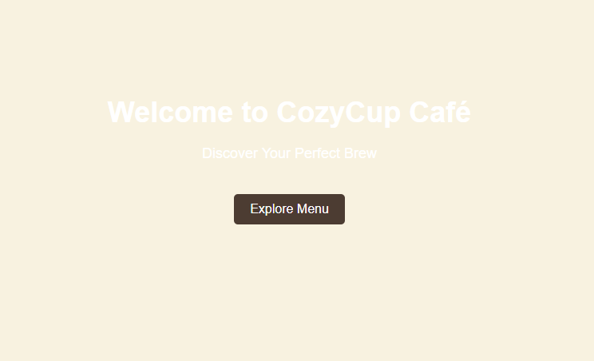
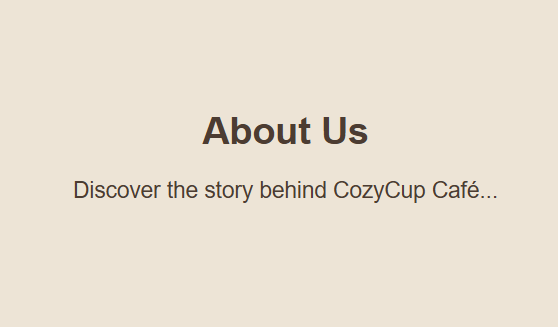
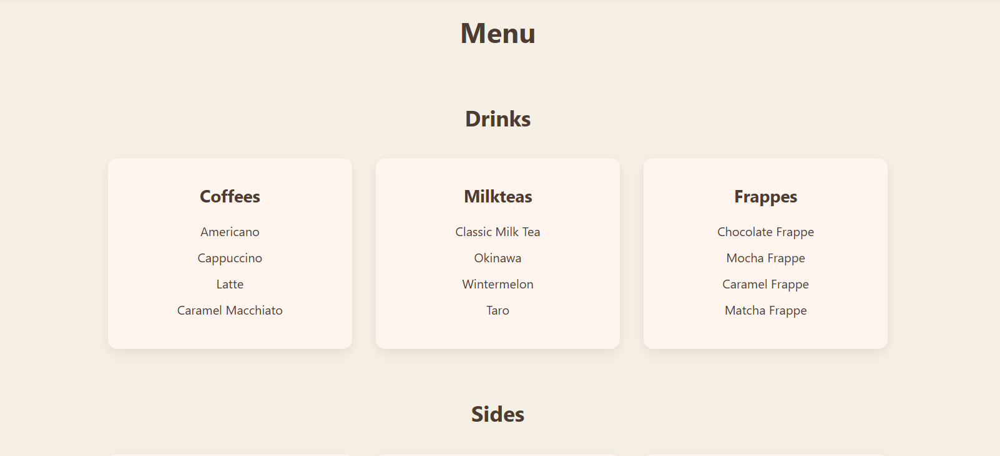
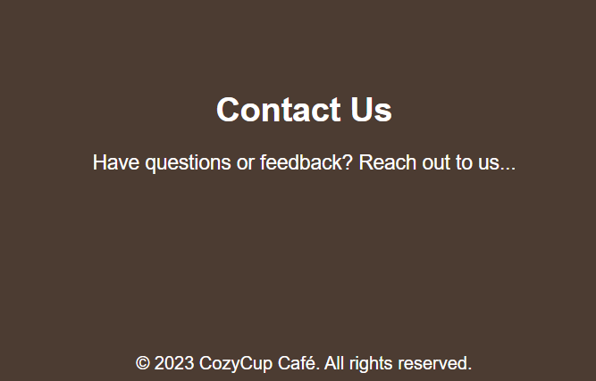

# Cozy Cup Cafe

## Project Description
Cozy Cup Cafe is a simple cafe website project designed to showcase a cozy coffee shop atmosphere. It presents the cafe’s branding, menu, and basic information using clean and beginner-friendly web design.

## Features
- Responsive cafe website layout
- Clean and simple user interface
- Menu and project showcase sections
- Contact and social media links
- Beginner-friendly HTML and CSS structure

## Screen Captures

**Home Page** – Displays the main landing page of the Cozy Cup Cafe website with branding and navigation.

**About Section** – Shows a brief description of the cafe and its cozy concept.

**Menu Section** – Shows menus of the Cozy Cup Cafe website.

**Contact Section** – Contains contact information and social media links.

## About the Authors

**Name:** Denzel Andrei Bermejo  
**Email:** shirooozzz13@gmail.com

### Connect with me

